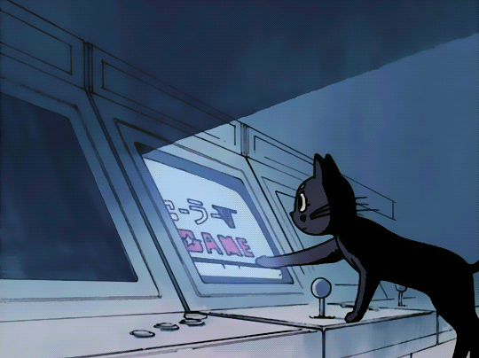
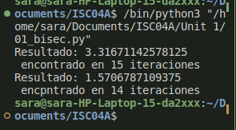
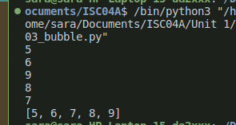
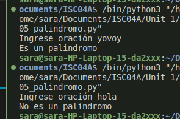
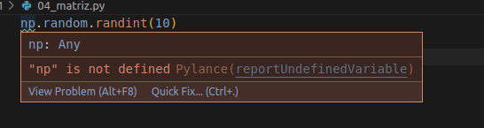

# 	:warning: _Unit 1 README_ 	:warning:

 <h2> 
 
 :space_invader: _Python Essentials 1_  :space_invader: </h2>

<h3>

_Description:_ Certificate of having finished succesfully </h3>

 

 <h2> 
 
 :space_invader: _Exercises_ :space_invader:</h2>

 :point_right:  _Bisection_  

_Output:_

 

 :point_right:  _Tickets_  

_Output:_

 

 :point_right:  _Bubble_  

_Output:_

 

 :point_right:  _Palíndromo_  

_Output:_

 

 :point_right:  _Matríz aleatoria_  

:warning:  _NOTE: Having made the program and tried several ways, I could not use the Numpy library. For some time I have had problems with my operating system (ubuntu) so it may be related to this and not being able to install the necessary packaging to use it. I have tried to use another programming environment to see better results, but I am still learning how to use it, the one I am using is Jupyter._ 

 